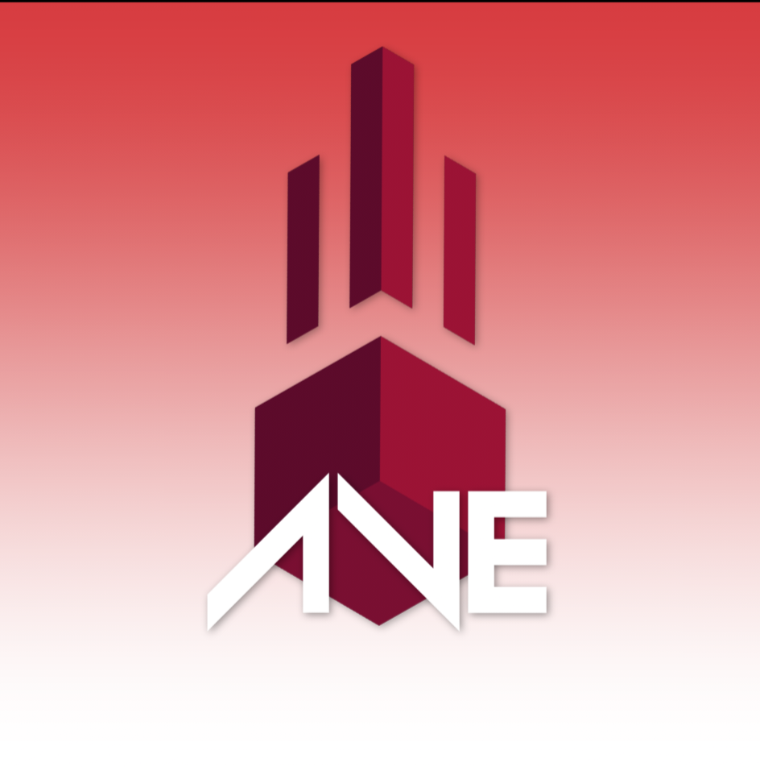
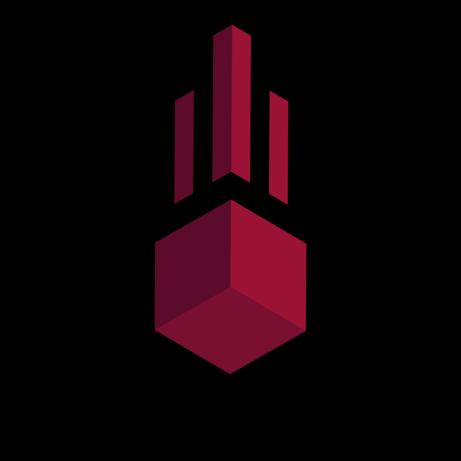
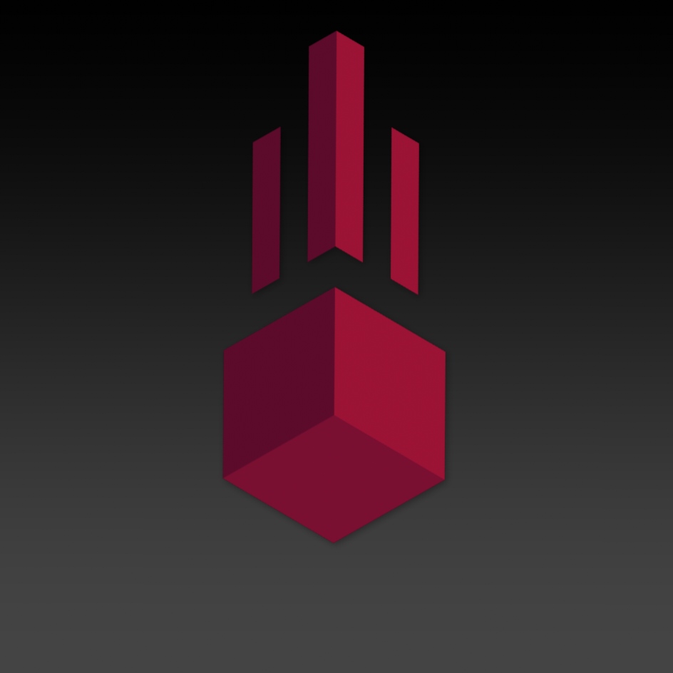

<div align="center">



<br><br>


&nbsp;&nbsp;&nbsp;&nbsp;


# ⚡ AVE Addon

**A lightweight utility addon for Meteor Client on Fabric 1.21.11**  
*Built with ❤️ (and questionable sanity) for the Minecraft community.*


<b>Copyright (c) 2026 Arvie (AVE Addon)</b>


</div>

---

## 📖 About

**AVE Addon** is a lightweight utility mod developed exclusively for **Fabric 1.21.11** and designed to integrate seamlessly with **Meteor Client 1.21.11**.

Instead of becoming another bloated client filled with hundreds of modules, AVE Addon focuses on providing polished quality-of-life features, advanced camera utilities, automation, and exploration tools while remaining lightweight and easy to configure.

---

## ✨ Features

### 🎥 Freecam+
An enhanced implementation inspired by Meteor Client's Freecam with additional gameplay improvements:
* **Detached Cinematic Camera:** Mine and interact using your real player while controlling the detached camera.
* **Input Isolation:** Complete keyboard input isolation while physical player continues obeying vanilla gravity.
* **Customization:** Adjustable movement speed, sprint multiplier, and sensitivity.
* **Safety Cutoffs:** Automatically disables upon damage received, dimension changes, or nearby player detection.

### 👀 Freelook+
A smoother alternative to the vanilla freelook experience:
* Independent camera rotation with **Camera No Collision**.
* Smooth **Fade-In / Fade-Out** animations.
* Continue moving and fighting normally while looking around.

### 🛡️ Anti Trap+
Client-side entity filtering to reduce visual clutter or escape obstructive traps.
* **Modes:** Hide & Restore / Destroy.
* **Features:** Affects every entity except players, includes custom entity picker, and instantly restores hidden entities when disabled.

### 🦴 Auto Craft Bone Meal
Automatically converts Bones into Bone Meal.
* Uses the player's 2×2 crafting grid with automatic inventory handling.
* Optional **Auto Drop Craft**.
* Built-in safety system that automatically disables after repeated interrupted crafting attempts.

### 📦 Auto Craft Bone Block
Automatically converts Bone Meal into Bone Blocks.
* Uses Crafting Tables in an automatic crafting loop.
* Optional **Auto Drop Craft**.
* Includes safety protection identical to Auto Craft Bone Meal.

### 📍 Chunk Stash
Locate storage chunks while exploring.
* **Supported Blocks:** Chest, Trapped Chest, Barrel, Shulker Box, Hopper, Furnace, Blast Furnace, Smoker, Dropper, Dispenser, and more.
* Saves each discovered chunk as its own stash point for future reference.

---

## ⌨️ Default Keybinds

| Action | Default Keybind |
| :--- | :--- |
| **Open Meteor Client** | `Right Shift` |
| **Sprint Freecam** | `Left CTRL` / `Right CTRL` |
| **Ascend** | `SPACE` |
| **Descend** | `LEFT SHIFT` |

---

## 📦 Requirements

- **Minecraft:** `1.21.11`
- **Java:** `21`
- **Fabric Loader**
- **Fabric API**
- **Meteor Client:** `1.21.11` *(Required as the addon base)*

---

## 🚀 Building & Installation

Run the development client:
```bash
./gradlew clean runClient

```
Build the production JAR:
```bash
./gradlew build

```
> The compiled .jar file will be generated in build/libs/.
>
## 📥 Downloads
* 📄 **Source Code:** [GitHub Repository](https://github.com/Arvie1290/AVE-Addon)
* 📦 **Releases:** [Download Latest JAR](https://github.com/Arvie1290/AVE-Addon/releases)
## ⚠️ Compatibility
AVE Addon is built specifically for **Minecraft 1.21.11**. Running it on other Minecraft versions is not supported and may result in mapping incompatibilities, broken Mixins, or unexpected crashes.
<div align="center">

Made with ☕ by <b>Arvie</b><br>
<i>Have fun debugging!</i>

</div>
